# devsecops-demo — a gated, supply-chain-aware delivery pipeline

A production-shaped demo of turning security scanners into **reliable controls**: PR-time gating, build-once digest promotion, signed + attested artifacts, policy-as-code gates with expiring exceptions, runtime verification (DAST + post-deployment smoke), and a manual-gated promotion path — running on a real Jenkins instance against a deliberately-vulnerable Flask app. **The pipeline is the artifact; every stage ships with its reasoning.**

```mermaid
flowchart LR
    classDef gate fill:#fff3cd,stroke:#e6a700,stroke-width:2px
    classDef fail fill:#f8d7da,stroke:#d63384
    classDef ok fill:#d1e7dd,stroke:#198754

    subgraph CI["CI — PR / feature branch · Jenkinsfile.ci · no credentials · untrusted"]
        A[checkout + fmt/lint/test<br/>ruff + pytest] --> B["secret-scan · gitleaks<br/>org rule ds-demo-&lt;32hex&gt;, SARIF"]
        B --> C["SAST · semgrep<br/>p/security-audit + org rules"]
        C --> D["SCA · syft + grype<br/>CycloneDX SBOM → vuln DB"]
        D --> E["IaC · trivy config<br/>builtin checks + org Rego DS-001/2/3"]
        E --> G1{{GATE · normalize + gate + report<br/>critical=FAIL · high=WARN · exceptions apply<br/>gitleaks never exceptable}}
    end
    G1 -- fail / warn --> X["build FAILURE | UNSTABLE<br/>report.md archived"]
    X:::fail
    G1 -- pass --> M["main"]
    M:::ok

    subgraph CD["CD — main · Jenkinsfile.cd · manual, parameterized"]
        F["build & push image ONCE<br/>3 tags · digest"] --> H["SBOM syft + trivy image scan<br/>CRITICAL/HIGH · VEX-filtered"]
        H --> G2{{GATE #1 · image gate<br/>fail-closed on missing artifacts}}
        G2 -- blocked --> Q["abort — nothing signed"]
        Q:::fail
        G2 -- pass --> I["cosign sign + SBOM attestation<br/>verify signature + attestation"]
        I --> J["helm package --sign + verify<br/>GPG provenance"]
        J --> K["deploy STAGING by digest<br/>non-root · PSS-style"]
        K --> L["ZAP DAST in-cluster · staging only"]
        L --> G3{{GATE #2 · incl. DAST<br/>stricter dast: high=fail · medium=warn}}
        G3 -- blocked --> R["stop — no promotion"]
        R:::fail
        G3 -- pass --> S["post-deployment verification<br/>health + smoke CRUD"]
        S --> T["manual approval"]
        T --> U["deploy PRODUCTION<br/>same digest · never rebuilt"]
        U:::ok
    end

    M --> F
```




## Security methods included

| Method | Tool | Phase | Gate behavior | Decision |
| --- | --- | --- | --- | --- |
| Secret scanning | Gitleaks `v8.21.2` (+ org rule `demo-api-token`) | CI | **Fails categorically** (`fail_tools`) — never exceptable | A leaked secret is a leak regardless of severity |
| SAST | Semgrep `1.155.0` (`p/security-audit` + org rules) | CI | Fail by **exploitability class** (SQLi/SSRF/deserial/RCE), warn otherwise | Vendor severity undervalues reachable injection |
| SCA / SBOM | Syft `v1.51.0` + Grype `v0.115.0` | CI (source) + CD (image) | Severity defaults + **KEV/EPSS overrides** | SBOM-first: CycloneDX out, Grype consumes SBOM |
| IaC / manifest | Trivy `0.74.0` config + **custom Rego** (DS-001/2/3) | CI | Org severity OVERRIDES vendor severity; CRITICAL Rego = fail | Policy-as-code: org risk > vendor labels |
| Image scanning | Trivy `0.74.0` + **OpenVEX** | CD pre-sign | Fail-closed gate #1 before anything is signed | Never sign/attest an image that failed its gate |
| Image signing + attestation | Cosign (key) | CD | Sign digest + SBOM `cyclonedx` attestation, then **self-verify** | Identity (sig) ≠ inventory (SBOM) |
| Chart provenance | Helm `package --sign` (GPG) | CD | `helm verify` with the **committed** public key | Deploy-unit authenticity; tamper detected |
| DAST | ZAP baseline, in-cluster Job | CD (staging) | Stricter `dast:` policy — high=fail, medium=warn | A finding on a live endpoint is worse than a static hit |
| Runtime verification | k8s probes + in-cluster smoke Job | CD | Hard-fail stage with diagnostics-fallback | Probes ≠ business logic; smoke proves the app works |
| Policy gate | `tools/{normalize,gate,report}.py` | CI + CD | One decision point per gate; exit codes 0/1/2/3 → pass/warn/fail/error | Scanners report; **the gate decides** |

---

# Overview

## Continuous Integration (`Jenkinsfile.ci`)

Triggered on PRs and pushes to `main`. Sequential stages for demo determinism; **no credentials** — the PR tier is untrusted.

> 🖼 Screenshot pending: `assets/screenshots/ci-01-stage-view.png` — full CI build, Stage View.

1. **Clone + unit tests** — ruff + pytest in pinned `python:3.12.7-slim`.
   *Why: cheapest control first; we don't scan broken code.*
2. **Dependency report** — Syft → CycloneDX SBOM → Grype → report, uploaded to the artifact store.
   *Why: SBOM-first; the inventory outlives the scan and can be re-evaluated as the vuln DB updates.*
3. **Static analysis** — gitleaks (secrets), semgrep (anti-patterns: formatted SQL, MD5), trivy (IaC, builtin + org Rego).
   *Why: generic rules (semgrep `p/security-audit`, trivy builtins) only catch what their vendors think is risky; the org rules carry the risks *this* codebase actually cares about (our secret format, unsafe SQL, MD5).*
4. **Gate** — `normalize → gate → report`; `fail`/`error` → FAILURE, `warn` → UNSTABLE.
   *Why: scanners run sequentially for a deterministic demo — in production they would run in parallel, and only the fastest + four independent exit codes would matter. A failing scan is kept separate from a failing *build*: the scanner's exit code just marks the stage red via `catchError`, while the gate's verdict decides the build status — otherwise a crashy scanner (or a stale rule) would block every merge, and a silently-broken scanner would look like a pass.*

## Configurable Gate

`security/policy.yaml` — action precedence: **exceptions** (expiring, fingerprint-matched) > **exploitability classes** > **categorical tools** (gitleaks) > **KEV/EPSS** > **severity defaults** (critical=fail, high=warn, medium=pass).

Fail-closed: absent scanner input = ERROR (exit 3), never a pass. Exception audit → `audit/exceptions-audit.jsonl`.

## Continuous Delivery (`Jenkinsfile.cd`)

Manual, parameterized. One build → one digest → gated promotion.


1. **Build & push image ONCE** — 3 tags (`<sha8>-<BUILD_NUMBER>`, `latest`, `<APP_VERSION>`), digest recorded.
   *Why: immutable identity + convenience pointers; only the digest is ever deployed.*
2. **Image SBOM + scan + GATE #1** — syft SBOM, trivy image scan (CRITICAL/HIGH, VEX-filtered); gate aborts fail-closed on missing artifacts.
   *Why: the scanned subject is the exact artifact that will be signed; nothing is signed from an ungated image.*
3. **Sign + verify** — cosign sign + SBOM attestation, verified against the public key; helm chart GPG-signed + verified with the committed key.
   *Why: two independent trust chains, zero secret material in the repo.*
4. **Deploy staging + DAST + GATE #2** — signed chart deploys the digest-pinned image (non-root, PSS-style); in-cluster ZAP baseline; gate evaluates static + DAST findings (stricter `dast:` policy).
   *Why: a runtime finding on a live endpoint is a different risk class; production never gets active scanning.*
5. **Verify + manual promote to production** — smoke Job (health, CRUD, search) + evidence; human approval; SAME digest deployed.
   *Why: promotion is an explicit human decision; byte-identical artifacts are what was gated.*


## Security Policy and CI violations

| `policy.yaml` rule | Example in this repo | CI result |
| --- | --- | --- |
| `fail_tools: [gitleaks]` | `ds-demo-<32hex>` token (seed, `app/config.py`) | Build **FAILS** — categorical, no exception possible |
| `fail_rule_classes` (SQLi/SSRF/deserial/RCE) | `/demo/unsafe-search` interpolates SQL (seed, `app/db.py:60`) | Build **FAILS** — reachable injection is blocking even at vendor-High |
| `fail_when` KEV / EPSS ≥ 0.9 | (metadata-driven; no current finding matches) | High+KEV → behaves as Critical |
| `severity_defaults` high → warn | MD5 password hashing (seed, `app/app.py:43`) | **UNSTABLE** unless excepted |
| Exceptions (expiring, fingerprint-matched) | EXC-0042 (MD5, expires 2026-09-13, ticket SEC-221) | Finding **EXCEPTED**; audit row written; expiry → fails closed |
| VEX (`--vex`) | gunicorn CVE-2024-6827 = `not_affected` (do-not-fix-forward case) | filtered at scan time — with evidence, not silence |
| Fail-closed gate | missing `trivy.sarif` / absent findings input | **ERROR** — a broken scan never looks like a pass |

## End to end showcase

All runs, normal and failure cases, with screenshots and capture checklists: **[docs/steps/README.md](docs/steps/README.md)**.

| Step | Path | Demonstrates |
| --- | --- | --- |
| 01 — CI normal run | [step-01-ci-normal-run.md](docs/steps/step-01-ci-normal-run.md) | full CI: scanners + gate verdicts (seeded FAILs), artifacts |
| 02 — CI warn/exception/VEX | [step-02-ci-gate-warn-and-exceptions.md](docs/steps/step-02-ci-gate-warn-and-exceptions.md) | UNSTABLE path, EXC-0042, VEX filtering, exception audit |
| 03 — CD staging path | [step-03-cd-staging-path.md](docs/steps/step-03-cd-staging-path.md) | build→gate→sign→chart→staging→DAST→vuln gate→smoke |
| 04 — CD failure cases | [step-04-cd-failure-cases.md](docs/steps/step-04-cd-failure-cases.md) | DAST SQLi blocks promotion; fail-closed missing artifact |
| 05 — CD production promotion | [step-05-cd-production-promotion.md](docs/steps/step-05-cd-production-promotion.md) | approval → same-digest prod deploy → verification evidence |
| 06 — Supply-chain verification | [step-06-supply-chain-verification.md](docs/steps/step-06-supply-chain-verification.md) | cosign sign/verify + SBOM attestation, chart GPG, tamper |

## Setup the Demo

Follow **[SETUP_DEMO.md](SETUP_DEMO.md)** — Docker Hub repo + token, kind cluster on the Jenkins agent, cosign + helm GPG keys, GitHub App, Jenkins plugins/credentials (credential IDs: `dockerhub`, `cosign-key`, `cosign-pub`, `kind-kubeconfig`, `helm-signing-key`), and the two multibranch jobs.

## Repository layout

```
Jenkinsfile.ci / Jenkinsfile.cd   the two pipelines (CI = source gates, CD = supply chain + deploy)
app/                              deliberately seeded Flask app (token, SQLi, MD5, gunicorn CVE)
security/                         policy.yaml (gate), exceptions.yaml (expiring), gitleaks/semgrep/trivy-rego/kyverno rules, VEX
tools/                            normalize.py · gate.py · report.py — the policy engine
deploy/helm/notes-app/            single versioned chart: app + DAST Job + smoke Job + regcred
deploy/helm/keys/public.asc       committed chart-signing public key (secret pair is a Jenkins credential)
docs/                             pipeline-stages.md (stage detail) · steps/ (e2e showcase) · DESIGN.md · VEX.md
SETUP_DEMO.md                     environment bring-up guide
```

Design narrative and the verified seed inventory: **[docs/DESIGN.md](docs/DESIGN.md)**. Stage-level detail and full reasoning: **[docs/pipeline-stages.md](docs/pipeline-stages.md)**.
