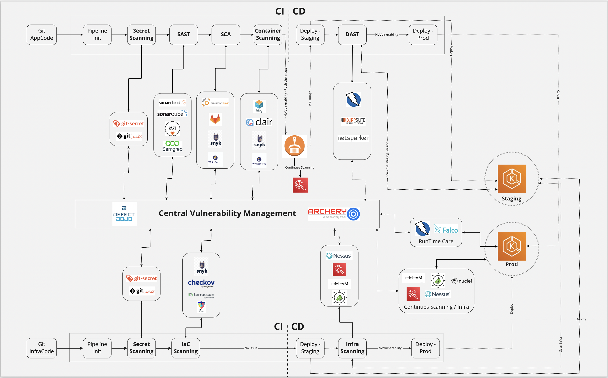

Suggested stages for a sample Java/Python app + container:

Secret scan (Gitleaks / TruffleHog)
SCA + SBOM (Syft + Grype, or OSV-Scanner / Dependabot-style)
SAST (Semgrep and/or your Java SAST direction; CodeQL if time)
IaC / manifest scan (Checkov or Trivy config on Terraform/K8s YAML)
Build image → Trivy (or Grype) → sign (Cosign demo)
DAST in pipeline or nightly (ZAP baseline, or a thin hook to your DAST thinking)
Deploy to kind/K8s with a simple gate (fail on Critical, warn on High, ticket on Medium)

**Security gate design**: severity, exploitability, reachability, exception process

- AI triage and prioritization

**Vuln Management**: https://defectdojo.com/pricing , free version

**Documentation**
produce lightweight internal-style docs (1–2 pages each):

- Secure SDLC map: where controls sit in demand → design → code → build → test → release → operate
- Tooling matrix: SAST / DAST / SCA / container / IaC / secrets / runtime — owner, gate type, noise strategy
- Vuln management flow: discover → triage → SLA → fix → verify → exception
- **Metrics**: coverage (% repos with SAST), MTTD/MTTR for Critical, false positive rate, % CI failures due to security, AI triage precision if you add it
- Threat modeling mini-practice: STRIDE on your sample app + on an “AI code-audit service”

**Pipeline**

Pipeline:
Jenkins
-> fmt/lint+unit tests+build image
-> {gitleaks, SAST, Syft+grype SBOM vuln check, Trivy image scan}
-> GATE: normalize -> policy -> decision, fail critical, warn high, exceptions, **Needs optimization**
-> docker buildx ONCE (provenance+SBOM) -> syft SBOM (CycloneDX) -> Trivy image scan
-> cosign sign
-> deploy to kind (or free tier cloud k8s cluster), Kyverno admission (verify images (sig+SBOM)+PSS+registry), smoke test (health)
-> DAST ZAP -> GATE (use npoc's strategies)

-> Vulns go into vuln management platform.
-> Manage metrics.

**tech stack**

- Jenkins: to run pipelines, use GKE or other free tier cloud provider to serve Jenkins
- Vuln management: Defect Dojo free tier

## Progress

- [ ] build the minimal pipeline with tool integration and minimal gates, run on a simple repo -> to validate it works
- [ ] Extend demo repos and design metrics
- [ ] Add AI triage and add metrics
- [ ] Design and implement more complex gates
